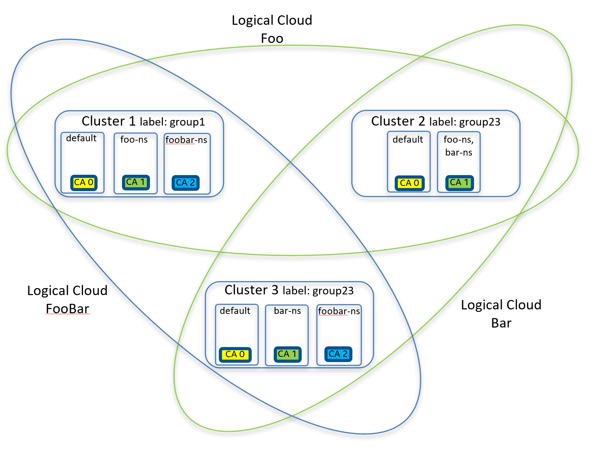

#### SPDX-License-Identifier: Apache-2.0
#### Copyright (c) 2022 Intel Corporation

# Running the EMCO CA Certificate Distribution example

This folder contains an example of the CA Certificate Distribution feature.  It provides examples of both the
`cluster-provider` and `logical-cloud` based forms of CA Certificate Distribution.

The `cluster-provider` variant of CA Certificate Distribution configures the default Istio CA certificates of a set of
clusters under a specified `cluster-provider` to all have a common CA root chain, as provided by the administrator.

The `logical-cloud` variant allows a set of clusters associated with one or more Logical Clouds to have a common CA root chain.

The following diagram illustrates the end state of this example if both variants are applied.



The diagram illustrates that three edge clusters are used.   The `cluster-provider` variant will distribute the `CA 0` certificates
as the default Istio CA for all three clusters.

Logical clouds `Foo` and `Bar` are both specified in the `logical-cloud` variant for `CA 1`.  As a result the namespaces `foo-ns`
`bar-ns` in all three clusters will be configured to have the common CA `CA 1`.  (note each cluster will have a common root but
its own Intermediate CA certificate).

Logical cloud `FooBar` is specified to use `CA 2` and results in namespace `foobar-ns` on Cluster1 and Cluster3 to be configured with a `CA 2`.

# Environment Setup and Assumptions

## Issuing Cluster setup

An issuing cluster is assumed to be configured by the administrator.  A cert-manager ClusterIssuer needs to be configured for
each CA root chain that will serve as a source for CA Certificate Intents.  This example will expect three ClusterIssuers to be
configured to provide the Intermediate CA Certs for `CA 0`, `CA 1` and `CA 2`.

### TBD - example sequence to set up ClusterIssuers

## Edge Cluster Setup

The EMCO CA Certificate Distribution example currently supports distributing and configuring CA Certificates to clusters where
Istio has been configured to use cert-manager as an external certificate signer.  This required cert-manager and Istio to be
installed with specific features enabled and/or configured.

Edge clusters which have been setup to satisfy these requirements will be labeled by EMCO `clm` (in the example).  These labels
can then be specified in the CA Cert Intents to identify the clusters which will be covered by the Intents (i.e. get configured
with CA Certificates).

### TBD - example sequence for installing cert-manager and Istio


# Running the examples

## Setup Test Environment to run test cases

The `setup.sh` script is available to create the `values.yaml` and `emco-cfg.yaml` files to use with `emcoctl`.

The following environment variables are expected to be set before running `setup.sh`:

  - ``HOST_IP``: IP address of the cluster (or machine) where EMCO is installed
  - ``KUBE_PATH_ISSUING``: points to where the kubeconfig for the edge cluster is located
  - ``KUBE_PATH1``: points to where the kubeconfig for the edge cluster 1 is located
  - ``KUBE_PATH2``: points to where the kubeconfig for the edge cluster 2 is located
  - ``KUBE_PATH3``: points to where the kubeconfig for the edge cluster 3 is located

The run the script:

    ```
    $ ./setup.sh create
    ```

    Output files of this command are:
    * ``values.yaml``: specifies useful variables for the creation of EMCO resources
    * ``emco_cfg.yaml``: defines the deployment details of EMCO (IP addresses and ports of each service)

    ```
    $ ./setup.sh cleanup
    ```

    Removes the artifacts previously generated.


## Description of the example resource files

* ``prerequisites.yaml``: defines basic EMCO resources and onboards and labels the three clusters for the example

* ``ca-certs-cluster-provider.yaml``: defines the CA Cert Intents for the `cluster-provider` variant

* ``ca-certs-cluster-provider-enrollment.yaml``: defines the enrollment command for the CA Cert Intents for the `cluster-provider` variant

* ``ca-certs-cluster-provider-distribution.yaml``: defines the distribution command for the CA Cert Intents for the `cluster-provider` variant

* ``logical-clouds.yaml``: defines the resources for the three standard Logical Clouds of the example:  `Foo`, `Bar` and `FooBar`

* ``logical-clouds-instantiate.yaml``: defines the instantiate commands for the three standard Logical Clouds of the example

* ``ca-certs-logical-clouds.yaml``: defines the CA Cert Intents for the `logical-cloud` variant

* ``ca-certs-logical-clouds-enrollment.yaml``: defines the enrollment commands for the two CA Cert Intents of the `logical-cloud` variant examples

* ``ca-certs-logical-clouds-distribution.yaml``: defines the distribution commands for the two CA Cert Intents of the `logical-cloud` variant examples

## Apply prerequisites first
Apply prerequisites.yaml. This is required for both CA Cert Intent variants. This creates controllers, one project, three clusters.

```
$ emcoctl --config emco-cfg.yaml apply -f prerequisites.yaml -v values.yaml
```

## Apply the `cluster-provider` variant

Apply the `cluster-provider` variant resource files to configure the default CA certs for the three clusters.

```
$ emcoctl --config emco-cfg.yaml -v values.yaml apply -f ca-certs-cluster-provider.yaml
$ emcoctl --config emco-cfg.yaml -v values.yaml apply -f ca-certs-cluster-provider-enrollment.yaml
$ emcoctl --config emco-cfg.yaml -v values.yaml apply -f ca-certs-cluster-provider-distribution.yaml
```

To terminate and delete run the following commands.  Note, this will also unconfigure the CA Certs in the clusters.

```
$ emcoctl --config emco-cfg.yaml -v values.yaml delete -f ca-certs-cluster-provider-distribution.yaml -w 5
$ emcoctl --config emco-cfg.yaml -v values.yaml delete -f ca-certs-cluster-provider-enrollment.yaml -w 5
$ emcoctl --config emco-cfg.yaml -v values.yaml delete -f ca-certs-cluster-provider.yaml
```

## Apply the `logical-cloud` variant

First, the logical clouds need to be created.

```
$ emcoctl --config emco-cfg.yaml -v values.yaml apply -f logical-clouds.yaml
$ emcoctl --config emco-cfg.yaml -v values.yaml apply -f logical-clouds-instantiate.yaml
```

Apply the `cluster-provider` variant resource files to configure the default CA certs for the three clusters.

```
$ emcoctl --config emco-cfg.yaml -v values.yaml apply -f ca-certs-logical-cloud.yaml
$ emcoctl --config emco-cfg.yaml -v values.yaml apply -f ca-certs-logical-cloud-enrollment.yaml
$ emcoctl --config emco-cfg.yaml -v values.yaml apply -f ca-certs-logical-cloud-distribution.yaml
```

To terminate and delete run the following commands.  Note, this will also unconfigure the CA Certs in the clusters.

```
$ emcoctl --config emco-cfg.yaml -v values.yaml delete -f ca-certs-logical-cloud-distribution.yaml -w 5
$ emcoctl --config emco-cfg.yaml -v values.yaml delete -f ca-certs-logical-cloud-enrollment.yaml -w 5
$ emcoctl --config emco-cfg.yaml -v values.yaml delete -f ca-certs-logical-cloud.yaml
```

Now, the logical clouds can be terminated and deleted.

```
$ emcoctl --config emco-cfg.yaml -v values.yaml delete -f logical-clouds-instantiate.yaml -w 5
$ emcoctl --config emco-cfg.yaml -v values.yaml delete -f logical-clouds.yaml
```


## Clean up the prerequisites

```
$ emcoctl --config emco-cfg.yaml -v values.yaml delete -f prerequisites.yaml
```
